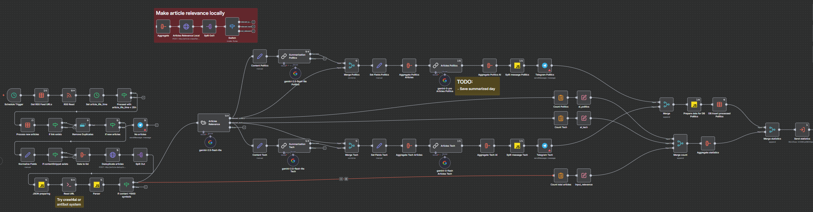
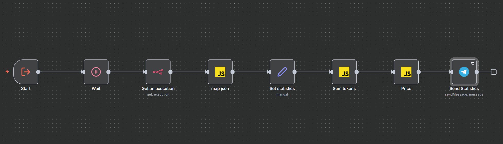

# n8n AI-Driven News Intelligence System

An intelligent news processing and distribution system built with N8N, combining web scraping, content analysis, deduplication, AI-generated summaries, daily analysis, and automated distribution through Telegram
>**Note**: This project is currently under active development. Features may change, and some components may not be fully stable

## 🎯 Overview

This system provides an end-to-end solution for:
- Collecting news articles from various sources
- Analyzing article relevance using AI models
- Deduplicating content based on semantic similarity
- Distributing curated news through Telegram
- Managing complex workflows with N8N automation
  
**Screenshots:**
<details>
  <summary>Click to open</summary>
  
  
  
</details>

## 🏗️ Architecture

### Core Services

- **N8N**: Workflow automation and orchestration engine
- **PostgreSQL**: Primary database for storing metadata and workflow data
- **Qdrant**: Vector database for semantic similarity search and deduplication
- **Ollama**: Local LLM service
- **Article Classifier**: ML service for article relevance classification (Hugging Face)
- **Article Deduplicator**: Service for identifying and filtering duplicate content

### Utilities

- **read_url**: Web scraping module for extracting article content (optionally using crawl4ai)
- **tg_tools**: Telegram management tool
- **article_relevance**: Classification service for determining article topic relevance
- **deduplicator_service**: Embedding-based content deduplication

## 📁 Project Structure

```
├── article_relevance/       # Article classification model & service
├── deduplicator_service/    # Content deduplication service
├── prompts/                 # AI prompts for different article categories
│   ├── articles_tech_system.md
│   └── politics_analytics_articles_system.md
├── read_url/                # Web content extraction utilities
├── tg_tools/                # Telegram bot integration
├── workflows/               # N8N workflow templates
│   └── News agregator template.json
├── Dockerfile               # Docker configuration for N8N
├── docker-compose.yml       # Multi-service orchestration
└── .gitignore
```

## 🚀 Quick Start

### Prerequisites

- Docker and Docker Compose
- Git

### Installation

1. Clone the repository:
```bash
git clone https://github.com/djoxpy/n8n-news-intelligence-system.git
cd n8n-news-intelligence-system
```

2. Create a `.env` file with required configuration:
```env
POSTGRES_USER=your_postgres_user
POSTGRES_PASSWORD=your_postgres_password
POSTGRES_DB=n8n
N8N_ENCRYPTION_KEY=super-secret-key
N8N_USER_MANAGEMENT_JWT_SECRET=even-more-secret
N8N_DEFAULT_BINARY_DATA_MODE=filesystem
N8N_HOST=0.0.0.0
N8N_PORT=5678
PUBLIC_DOMAIN=your_public_domain
GENERIC_TIMEZONE=UTC
N8N_PATH=/
N8N_EDITOR_BASE_URL=/
OLLAMA_HOST=ollama:11434
```

3. Start services using Docker Compose:
```bash
docker-compose up -d
```

4. Access N8N interface at `https://your_public_domain:5678`

5. Import all workflows from the `workflows` folder

## 🔧 Services Configuration

### N8N
- Accesses PostgreSQL for workflow storage
- Connects to all microservices for content processing
- Provides visual workflow editor

### Article Classifier
- Port: 8020
- Uses Hugging Face transformers
- Evaluates article relevance for specified topics

### Article Deduplicator
- Port: 8000
- Uses embeddings for similarity detection
- Configurable similarity threshold (default: 0.85)

### Ollama
- Port: 11434
- Supports local LLM inference

## 📊 Workflow Features

The system includes templates for:
- **News Aggregation**: Collecting articles from multiple sources
- **Content Analysis**: Classifying articles by relevance (Tech, Politics, Analytics)
- **Deduplication**: Removing semantically similar content
- **Distribution**: Sending curated news via Telegram

## 🤖 AI Prompts

Customizable system prompts for different content categories:
- Political and Technology article analysis

Edit prompts in the `prompts/` directory to customize article analysis behavior and place them in the specified nodes in N8N.

## 📝 Environment Variables

| Variable | Description | Default |
|----------|-------------|---------|
| POSTGRES_USER | Database user | - |
| POSTGRES_PASSWORD | Database password | - |
| POSTGRES_DB | Database name | n8n |
| N8N_HOST | N8N hostname | localhost |
| N8N_PORT | N8N port | 5678 |
| OLLAMA_HOST | Ollama service address | ollama:11434 |
| SIMILARITY_THRESHOLD | Deduplication threshold | 0.85 |

## 🔌 API Endpoints

- **N8N**: `http://n8n:5678`
- **Article Classifier**: `http://article-classifier:8020`
- **Article Deduplicator**: `http://article-deduplicator:8000`
- **Ollama**: `http://ollama:11434`

## 🛠️ Development

### Building Custom Services

Each service has its own Dockerfile. To rebuild:

```bash
# Rebuild all services
docker-compose build

# Rebuild specific service
docker-compose build article-classifier
```

### Running Services Individually

```bash
# Start specific service
docker-compose up -d article-classifier

# View logs
docker-compose logs -f article-classifier
```

## 📦 Dependencies

- n8n.io (workflow automation)
- PostgreSQL (database)
- Qdrant (vector database)
- Ollama (LLM inference)
- Hugging Face Transformers (ML models)
- crawl4ai (web scraping)
- FastAPI (microservices)

## 🔐 Security Considerations

- Store sensitive credentials in `.env` file
- Never commit `.env` to version control
- Use strong database passwords
- Configure N8N authentication
- Validate all external inputs

## 📚 Documentation

For detailed documentation on each component:
- [Article Classifier](./article_relevance/README.md)
- [Deduplicator Service](./deduplicator_service/README.md)

## 🤝 Contributing

1. Fork the repository
2. Create feature branch (`git checkout -b feature/amazing-feature`)
3. Commit changes (`git commit -m 'Add amazing feature'`)
4. Push to branch (`git push origin feature/amazing-feature`)
5. Open Pull Request

## 📄 License

This project is provided as-is. Please review license requirements for dependencies.

## 🐛 Troubleshooting

### Services won't start
- Check Docker daemon is running
- Verify port availability (5678, 8000, 8020)
- Review logs: `docker-compose logs`

### Database connection errors
- Ensure PostgreSQL is healthy: `docker-compose ps`
- Verify credentials in `.env`
- Check network connectivity

### Article classifier issues
- Verify Hugging Face model download
- Check available GPU/CPU memory
- Review classifier logs: `docker-compose logs article-classifier`

## 📧 Support

For issues and questions, open an issue on GitHub.

---
***Built with N8N, Python, and Docker*** 🚀
